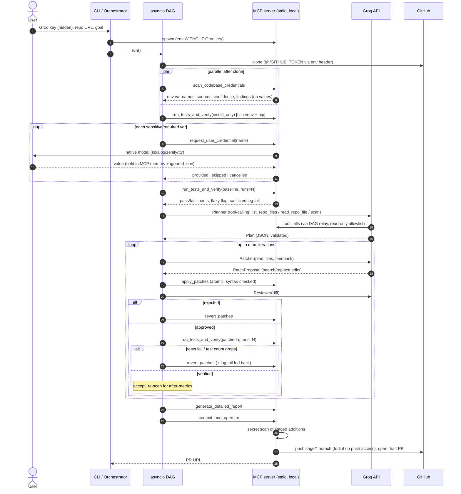

# S.A.G.E. — Local Execution Bridge

## 1. System architecture (sequence)

DAG: `clone → {scan ∥ analyze ∥ install}`, `review` (scan+analyze), `credentials` (scan) → `baseline` (install+credentials) → `plan` → `patch_loop` → `report` → `publish`. See README for the diagram.
A failed node skips its dependents; independent branches keep running.

## 2. Secret-handling boundaries

| Secret | Lives in | Never reaches |
|---|---|---|
| Groq key | Orchestrator memory (`SecretStr`) | MCP server env, logs, state |
| Live-test credentials | MCP server memory + `0600 .env` (git-ignored) | Orchestrator, Groq, report, commits |
| GitHub token | MCP server memory; passed to git via `GIT_CONFIG_*` env | argv, logs |
| Secrets found in repo source | Registry → masked as `{{SAGE_SECRET_n}}` for the LLM | LLM prompts, diffs, PR body |

Note: repository *source* is sent to Groq; credentials you enter are not.

## 3. Edge cases

| Case | Behaviour |
|---|---|
| No tests / 0 collected | Falls back to **static verification**: compileall passes, no new findings, weighted finding score strictly drops; PR marked lower-assurance |
| Patch breaks syntax / search not unique | Whole edit set rejected atomically; error fed back |
| Patch deletes tests | Rejected (collected count must not drop) |
| Flaky suite | `runs` repeats; all must pass; flaky flag in report |
| Groq 429/5xx/timeout | Exponential backoff + jitter, honours `Retry-After` |
| Invalid LLM JSON | Up to 3 repair rounds with validation errors |
| No push access | Auto-fork, PR from fork |
| Secret in staged additions | Commit aborted, index reset |
| Test hangs | Process-group SIGKILL on timeout |
| Credential dialog cancelled | Remaining prompts skipped |
