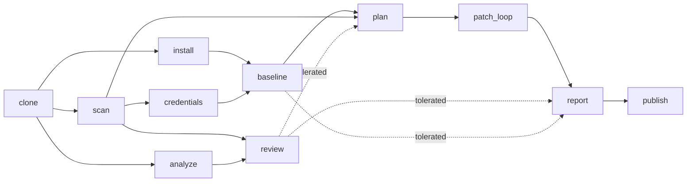
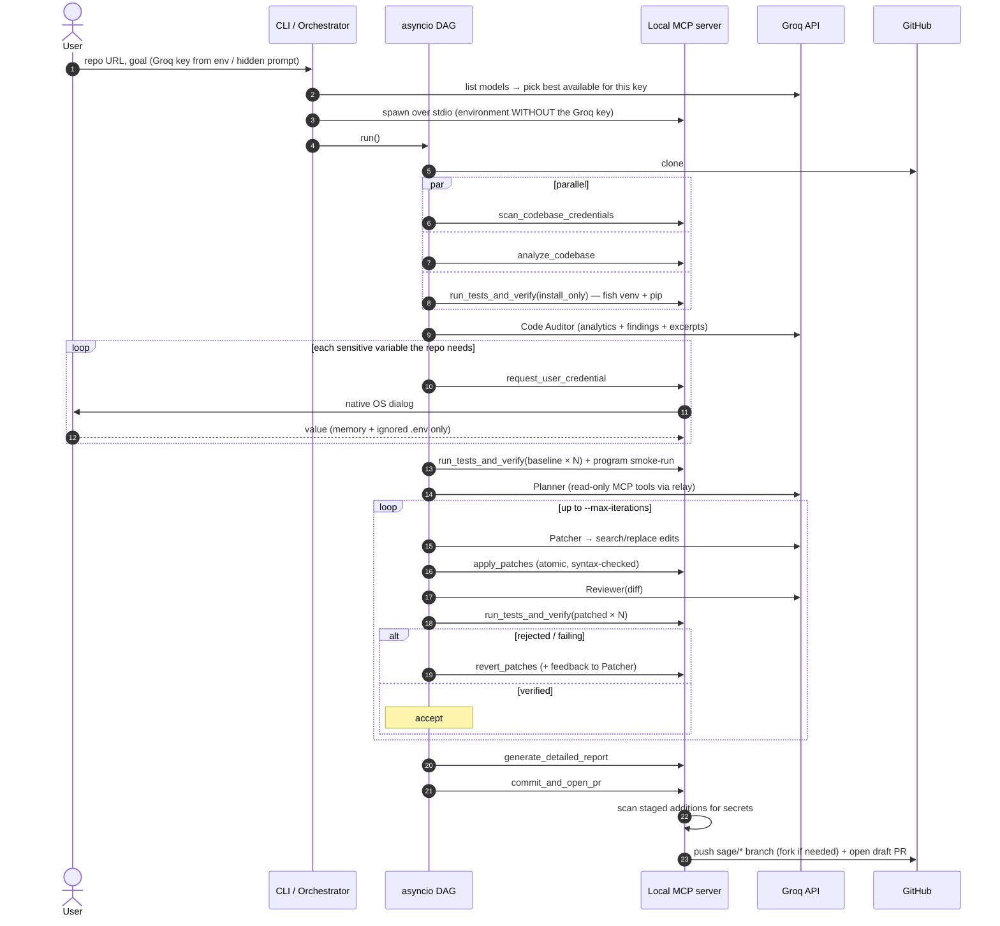

<div align="center">

# S.A.G.E.
### Secure Agentic Git Engine — *an agentic MCP orchestrator*

**Point it at a GitHub repository and a vague goal. It clones, analyzes, reviews, patches, verifies, and opens a pull request — locally, with your secrets never leaving your machine.**

`Python 3.11+` · `asyncio DAG` · `Model Context Protocol` · `Groq LLMs` · `Pydantic v2` · `Fish shell / Arch Linux`

</div>
GitGuardian's [*State of Secrets Sprawl 2026*](https://blog.gitguardian.com/the-state-of-secrets-sprawl-2026/) report counted about 28.65 million new hardcoded secrets in public GitHub commits during 2025 — a 34% year-over-year increase — and found that commits co-authored by AI coding assistants leaked secrets at roughly twice the baseline rate. AI agents also need local credentials to do their work, which widens the attack surface.

We want the power of AI, but we cannot afford the security risk of giving cloud agents our private keys.


---


---

## Table of contents
1. [What is S.A.G.E.?](#1-what-is-sage)
2. [Key features](#2-key-features)
3. [How it works](#3-how-it-works)
4. [Verification — the safety net](#4-verification--the-safety-net)
5. [Security model](#5-security-model)
6. [MCP tool suite](#6-mcp-tool-suite)
7. [Installation (CachyOS / Arch + Fish)](#7-installation-cachyos--arch--fish)
8. [Usage](#8-usage)
9. [CLI reference](#9-cli-reference)
10. [Live dashboard](#10-live-dashboard)
11. [What a run produces](#11-what-a-run-produces)
12. [Project structure](#12-project-structure)
13. [Testing](#13-testing)
14. [Troubleshooting](#14-troubleshooting)
15. [Limitations](#15-limitations)
16. [Roadmap](#16-roadmap)
17. [License](#17-license)

---

## 1. What is S.A.G.E.?

S.A.G.E. is a **local-first, multi-agent repository repair system**. You give it:

* a GitHub repository URL, and
* a goal in plain English — e.g. *"This repo is flaky in CI, find out why and fix what is safe"*.

It then runs a pipeline of single-purpose workers (a DAG scheduled with `asyncio`) that **clone** the repository into an isolated workspace, **scan** it for credentials and vulnerabilities, compute **code analytics**, produce an **LLM code review**, ask a **Planner → Patcher → Reviewer** agent loop (Groq API) to write fixes, **verify every patch** by actually running the project, and finally **push a separate branch and open a draft pull request** with a detailed report.

The agents call real tools through an **MCP (Model Context Protocol) server** that runs on your machine. The LLM never touches your shell, your keys, or your Git credentials directly.

> **Design principle — verification first.** The AI is never trusted. A patch that is untested, fails its checks, removes tests, or introduces new findings is rejected automatically and reverted.

## 2. Key features

| Area | Capability |
|---|---|
| **Orchestration** | `asyncio` DAG scheduler: parallel stages, per-node timeouts and retries, failure isolation (a failed node skips only its dependents), cycle detection |
| **Agents** | Planner (tool-calling), Patcher (search/replace edits), Reviewer (diff audit), Code Auditor (repo review) — all on the **Groq API** with exponential backoff, JSON repair, automatic model discovery and fallback |
| **MCP server** | Local stdio MCP server exposing strictly-typed (Pydantic) tools for scanning, credential capture, verification, patching, reporting, and PR creation |
| **Static analysis** | Python `ast` + regex: expected env vars, API-client signatures, hardcoded secrets, `shell=True`, unsafe `yaml.load`/`pickle`, SQL string-building, missing HTTP timeouts, `sleep()` in tests, and more — each with a confidence score |
| **Analytics** | Files / LOC by language, function count, cyclomatic-complexity hotspots, TODO density, test presence, dependency manifests |
| **Verification** | Three modes: full test suite (repeated for flake detection), compile + finding-score, and entrypoint smoke-run equivalence |
| **Secrets** | Live-test credentials captured via a native OS dialog (`kdialog` / `zenity`), held in memory + a `0600` git-ignored `.env`; never sent to the LLM, never logged, never committed |
| **GitHub** | Uses your local credentials (`gh`), creates a **new branch in the same repo** (auto-fork when you lack push access), opens a **draft PR** whose body is the full report |
| **Live dashboard** | Real-time browser view of the DAG, logs, analytics, findings, review, and **before/after program output** |
| **Platform** | Idiomatic for **CachyOS / Arch Linux** and the **Fish** shell; zero-cost (only your Groq key) |

## 3. How it works

### 3.1 The DAG



A failed stage skips only the stages that depend on it. Even when no patch survives, `report` and `publish` still run so you always get a **review-only branch** with the analytics and code review.

### 3.2 End-to-end sequence



### 3.3 The agents

| Agent | Role | Tools |
|---|---|---|
| **Code Auditor** | Writes an honest review: summary, strengths, issues with severity, optimization ideas | none (receives analytics + findings + hot files) |
| **Planner** | Investigates, forms hypotheses, chooses ≤ 6 target files | read-only MCP tools (`list_repo_files`, `read_repo_file`, `scan_codebase_credentials`) |
| **Patcher** | Emits minimal exact-match `search`/`replace` edits (never whole-file rewrites) | none |
| **Reviewer** | Audits the applied diff for regressions, scope creep, leaked secrets, weakened tests | none |

All agent output is parsed into Pydantic models; invalid JSON triggers up to three repair rounds with the validation error fed back to the model.

## 4. Verification — the safety net

A patch is **accepted only if the project proves it still works**. S.A.G.E. picks the strongest verification available:

| Mode | When | A patch is accepted if… |
|---|---|---|
| **Tests** *(strongest)* | pytest tests exist | the suite passes on **every** run (`--runs`, default 3, to catch flakiness), the collected test count did **not drop**, and the Reviewer approved |
| **Static + compile** | no tests, findings exist | every file compiles, **no new findings** appear, and the weighted finding score **strictly decreases** |
| **Smoke-run equivalence** | no tests, no findings (optimization mode) | files compile, no new findings, and the program's entrypoint produces the **identical exit code and output** before and after |

Static and smoke modes are explicitly labelled **lower assurance** in the PR. Every rejected attempt is reverted automatically and its failure log is fed back to the Patcher for the next iteration.

## 5. Security model

| Secret | Lives in | Never reaches |
|---|---|---|
| **Groq API key** | Orchestrator memory (`SecretStr`) | the MCP server environment, logs, DAG state, reports |
| **Live-test credentials** you enter | MCP-server memory + a `0600` `.env` (auto-added to `.gitignore`) | the orchestrator, the LLM, the report, any commit |
| **GitHub token** | MCP-server memory; passed to `git` through `GIT_CONFIG_*` environment variables | process arguments (`ps`), logs |
| **Secrets found in repo source** | A redaction registry; shown to the LLM only as `{{SAGE_SECRET_n}}` placeholders | LLM prompts, diffs, PR body |

Additional guards:

* **Path safety** — all edits are confined to the workspace; `.git`, `.env`, `.venv`, `.sage` are protected; traversal is rejected.
* **No shell injection** — repo-derived data is never interpolated into Fish source; it travels via the environment or `$argv`.
* **Commit-time secret scan** — staged additions are scanned; any secret-like value aborts the commit and resets the index.
* **Process isolation** — test runs execute in their own process group and are `SIGKILL`ed on timeout.
* **Strict schemas** — every tool input/output is a `extra="forbid"` Pydantic model; no model has a field that can carry a credential value.

> **Be aware:** your repository's *source code* is sent to Groq for analysis and patching. The credentials you enter for live testing are not.

## 6. MCP tool suite

| Tool | Purpose | Returns |
|---|---|---|
| `scan_codebase_credentials` | AST + regex walk for env vars, API-client calls, vulnerabilities | names, sources, confidence — **never values** |
| `request_user_credential` | Native OS modal for one credential | `provided` \| `skipped` \| `cancelled` only |
| `run_tests_and_verify` | Fish venv + dependency install + pytest × N / compile / smoke-run | exit status, pass/fail, flake flag, sanitized log tail |
| `commit_and_open_pr` | New `sage/*` branch, commit, secret scan, push (fork if needed), draft PR | PR URL, branch, commit SHA |
| `generate_detailed_report` | Writes `SAGE_REPORT.md` (also the PR description) | path, size |
| `analyze_codebase` | LOC, languages, complexity hotspots, TODOs, test presence | analytics model |
| `list_repo_files` / `read_repo_file` | Read-only workspace access (secrets masked) | file list / content |
| `apply_patches` / `revert_patches` | Atomic, syntax-checked search/replace edits and rollback | applied flag, diff, errors |

## 7. Installation (CachyOS / Arch + Fish)

```fish
git clone https://github.com/sriyansh-dev/S.A.G.E-AGENTIC-MCP-ORCHESTRATOR.git sage; and cd sage
fish bootstrap.fish
```

`bootstrap.fish` installs `git github-cli python python-pip fish kdialog zenity` with `pacman`, creates `.venv`, installs `requirements.txt`, and runs `gh auth login` if needed.

Manual equivalent:

```fish
sudo pacman -S --needed git github-cli python python-pip fish kdialog zenity
python -m venv .venv; and source .venv/bin/activate.fish
pip install -r requirements.txt
gh auth login --web -h github.com -p https
```

**Requirements:** Python ≥ 3.11 · Fish ≥ 3.6 · Git · GitHub CLI (or `GITHUB_TOKEN`) · a free [Groq API key](https://console.groq.com/keys).

## 8. Usage

```fish
source .venv/bin/activate.fish

# Put the key on the SAME line as `set` (paste with Ctrl+Shift+V in terminals)
set -x GROQ_API_KEY gsk_...

python -m sage \
  --repo https://github.com/<you>/<repo> \
  --goal "fix failing tests and security issues"
```

Run it with no flags and S.A.G.E. prompts for the key (hidden), repository, and goal. Add `--dry-run` to verify and commit **locally** without pushing.

When it finishes it prints the branch, PR URL, report path, and the workspace path of the **updated code**, and (if the `code` command exists) opens that workspace in a new VS Code window.

## 9. CLI reference

| Flag | Default | Description |
|---|---|---|
| `--repo URL` | prompt | GitHub repository (`https://github.com/owner/repo`) |
| `--goal TEXT` | prompt | What you want fixed or reviewed |
| `--groq-key KEY` | `$GROQ_API_KEY` / prompt | Avoid on shared machines: argv is visible in `ps` |
| `--model ID` | auto | Preferred Groq model; otherwise the best model your key can use is chosen |
| `--runs N` | 3 | Test runs per verification (flake detection), 1–10 |
| `--max-iterations N` | 3 | Patch attempts before giving up |
| `--test-timeout S` | 600 | Per test-run timeout |
| `--workspace-root DIR` | `~/.cache/sage/workspaces` | Where clones live |
| `--dry-run` | off | Verify + commit locally; do not push or open a PR |
| `--no-ui` | off | Disable the live dashboard |
| `--port N` | random | Dashboard port |
| `--no-open` | off | Do not open the workspace in VS Code at the end |

## 10. Live dashboard

On start, S.A.G.E. prints `LIVE DASHBOARD: http://127.0.0.1:<port>/` and tries to open your browser. In VS Code: **Ctrl+Shift+P → "Simple Browser: Show" → paste the URL**.

The page (served from `127.0.0.1` only, no external assets) updates every second with: DAG node states, live log, analytics and complexity hotspots, findings, the code review, **BEFORE vs AFTER program output**, and the final PR link.

## 11. What a run produces

* A new branch `sage/fix-…` (verified code changes + report) or `sage/review-…` (report only) in the **same repository**
* A **draft PR** whose description is `SAGE_REPORT.md`:
  goal · summary · before/after metrics · code analytics · code review · findings table · changes · attempt log · live program run (before/after) · verification policy
* A local, updated clone you can inspect: `cd <workspace>; git diff <default-branch>..HEAD`

## 12. Project structure

```
sage/
├── cli.py          # entry point, prompts, dashboard + VS Code launch
├── pipeline.py     # the DAG wiring, patch loop, acceptance gates
├── dag.py          # asyncio DAG scheduler
├── agents.py       # Planner / Patcher / Reviewer / Code Auditor prompts
├── llm.py          # Groq client: backoff, model discovery, JSON repair, tool loop
├── bridge.py       # MCP client (spawns the local server)
├── mcp_server.py   # MCP server exposing the tools
├── tools.py        # tool implementations (Toolbox) + report renderer
├── scanner.py      # AST + regex discovery of env vars / clients / vulnerabilities
├── analytics.py    # LOC, complexity, TODOs, test presence
├── runner.py       # Fish venv bootstrap, pytest / compile / smoke execution
├── git_ops.py      # clone, GitHub API, auth, fork, PR
├── credentials.py  # native credential dialogs + in-memory vault
├── redact.py       # secret detection, redaction, reversible masking
├── retry.py        # exponential backoff with jitter
├── live.py         # live dashboard server
└── schemas.py      # all Pydantic models (strict)
tests/              # unit + end-to-end tests (mocked Groq/GitHub, real MCP, real Fish)
```

## 13. Testing

```fish
python -m pytest -q tests
```

The suite covers the scanner, redaction, DAG ordering/parallelism/retries, atomic patching and rollback, Groq backoff / model rotation / JSON-mode fallback, Fish script syntax, and **full end-to-end pipelines** through a real MCP stdio server with a mocked Groq API and local git: a wrong patch is rejected by the tests, a correct one is verified and committed; a no-tests repo is handled in static and smoke modes; and a review-only branch is produced when no patch survives. Real GitHub pushes and LLM quality are exercised manually.

## 14. Troubleshooting

| Symptom | Fix |
|---|---|
| `No module named sage` | Run from the project root (the folder containing `sage/`) with the venv active |
| `Groq HTTP 404 … model does not exist or you do not have access` | Fixed automatically: S.A.G.E. lists the models your key can use. Don't pass `--model` for a model you lack |
| `Failed to generate JSON` (HTTP 400) | Handled: the client retries in plain mode and extracts the JSON itself |
| Can't paste the key | Use `set -x GROQ_API_KEY ` + **Ctrl+Shift+V** on the same line; plain Ctrl+V doesn't paste in terminals |
| `Cannot push without GitHub credentials` | `gh auth login --web -h github.com -p https`, or use `--dry-run` |
| `no tests were found` / nothing patched | Expected on repos without tests and findings — you still get the review-only branch |
| Credential dialog doesn't appear | Install `kdialog` (KDE) or `zenity`; otherwise it falls back to a hidden prompt on `/dev/tty` |
| Groq rate limit (429) | Short limits are retried with backoff; a long or daily limit switches to another model, and if none is left it stops with a clear message. Wait and rerun, or use another key |

## 15. Limitations

* **Python-first verification.** Tests, compile checks, and smoke-runs target Python projects (pytest). Other languages are scanned by regex only.
* **Static / smoke modes are weaker than tests** and are labelled as such. Smoke-runs execute the repository's entrypoint (20 s limit) — only run S.A.G.E. on code you are willing to execute locally.
* **LLM quality varies.** Patches that the verifiers reject are discarded; S.A.G.E. can fail to find a fix.
* **Groq only**, and the free tier has tight tokens-per-minute limits.
* **GitHub.com only** (no GitLab / GitHub Enterprise).
* Repository source is sent to Groq.

## 16. Roadmap

* Language adapters (Node/Jest, Go test) for verification
* Automatic generation of characterization tests for untested repos
* Per-finding patch strategies and a CI-log ingestion node for flaky-test diagnosis
* Pluggable LLM providers (local Ollama) for fully offline operation

## 17. License

MIT — see [LICENSE](LICENSE).

<div align="center"><sub>Built by Sriyansh Raj · S.A.G.E. = Secure Agentic Git Engine</sub></div>
